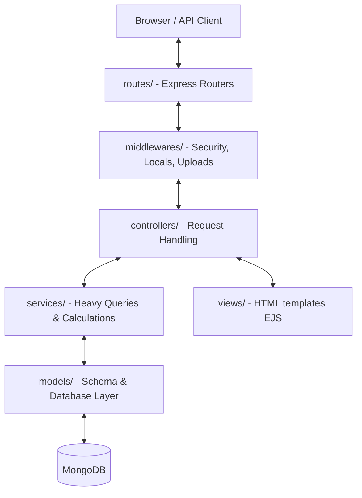

# 🎓 E-Commerce Project: Complete Enterprise-Grade Architecture Analysis

Welcome to the ultimate architectural analysis of your hybrid E-Commerce web application and headless API. This document breaks down the system's design, file linkages, request cycles, database schema constraints, and advanced engineering solutions (like race-condition prevention) to give you absolute command over the codebase for your evaluations, viva, or future refactoring.

---

## 🏗️ 1. High-Level System Architecture & Stack

Your application is built using a **Modular MVC (Model-View-Controller)** pattern. It leverages **CommonJS modules** (`require`) to decouple business logic, routing, middlewares, and data layers. The tech stack includes:

*   **Runtime & Framework**: [Node.js](https://nodejs.org) with the [Express](https://expressjs.com) framework.
*   **Database**: [MongoDB](https://www.mongodb.com) using the [Mongoose ODM](https://mongoosejs.com) (Object Document Mapper) for schemas.
*   **Front-End Rendering**: [EJS](https://ejs.co) (Embedded JavaScript templates) for server-side HTML rendering.
*   **State Management**: Session-based cookie state via `express-session` backed by flash messages via `connect-flash`.
*   **Headless Integration**: Stateless REST API protected by JSON Web Tokens (`jsonwebtoken`).
*   **Security & Helpers**: Secure password hashing with `bcryptjs` and file uploads via `multer`.

### The Modular MVC Architecture



---

## 📂 2. Directory & Linkage Blueprint

Every file in the project has a single, highly-focused responsibility. Below is the blueprint of how they interact:

### ⚙️ Configuration Layer (`config/`)
Handles the environment connections.
*   **`config/db.js`**: Connects to the MongoDB instance using environmental variables.
    *   *Linkage*: Imported and executed exactly once in `server.js` on startup.

### 💾 Model Layer (`models/`)
Enforces strict schema validation, default data states, and data relationships.
*   **`models/User.js`**: User entity including password hashing hooks and validation.
    *   *Linkage*: Queried by `controllers/authController.js` and `controllers/apiController.js`.
*   **`models/Product.js`**: Product inventory schema including strict categories, sub-categories, price numbers, and stock metrics.
    *   *Linkage*: Queried by `services/productService.js` and controllers to manage stock levels.
*   **`models/Order.js`**: Orders history records containing snapshots of purchased goods and shipping structures.
    *   *Linkage*: Populated and saved during checkout in standard views and `/api/v1` routes.

### 🛡️ Middleware Layer (`middlewares/`)
Intercepts incoming HTTP requests to secure routes, update contexts, or process uploads.
*   **`middlewares/auth.js`**: Implements three key locks:
    1.  `isLoggedIn`: Blocks guest users from checking out or reading private orders, redirecting them to `/login`.
    2.  `isAdmin`: Blocks non-admin users from accessing dashboard administration endpoints.
    3.  `verifyToken`: Parses, validates, and decodes incoming Bearer JWT tokens for headless API routes.
*   **`middlewares/locals.js`**: Exposes session variables (authenticated user details, dynamic flash notifications, and current cart items count) globally to the EJS engine.
    *   *Linkage*: Mounted globally in `server.js` using `app.use(setLocals)`.
*   **`middlewares/upload.js`**: Sets up `multer` storage destinations and filenames for product image submissions.
    *   *Linkage*: Injected into the admin route handler in `routes/adminRoutes.js`.

### 🛣️ Routing Layer (`routes/`)
Maps endpoints directly to their corresponding business controllers.
*   **`routes/authRoutes.js`**, **`productRoutes.js`**, **`cartRoutes.js`**, **`checkoutRoutes.js`**, **`orderRoutes.js`**, **`adminRoutes.js`**, **`apiRoutes.js`**
    *   *Linkage*: Created as individual `express.Router()` instances, exported, and mounted onto the core Express app in `server.js`.

### 🎮 Controller Layer (`controllers/`)
Coordinates the request-response lifecycle. It receives parameters, calls helper services, validates forms, and sends JSON packets or renders EJS pages.
*   **`controllers/authController.js`**: Handles registration, credentials check, and session lifecycles.
*   **`controllers/productController.js`**: Renders catalog categories by utilizing `productService.js`.
*   **`controllers/cartController.js`**: Handles cart actions, validating real-time inventory levels.
*   **`controllers/checkoutController.js`**: Manages order checkout, secure billing, and stock deductions.
*   **`controllers/orderController.js`**: Fetches order histories.
*   **`controllers/adminController.js`**: Grants full CRUD powers for products and order dispatch status editing.
*   **`controllers/apiController.js`**: Powers all JSON-only headless endpoints.

### 🧠 Service Layer (`services/`)
Separates heavy logic and calculations out of controllers to keep code clean and reusable.
*   **`services/cartService.js`**: Computes totals, counts, and items stored in the user session cart.
*   **`services/productService.js`**: Filters products dynamically based on search, price bounds, category, page pagination index, and subcategories.

---

## ⚡ 3. Deep-Dive on Core Features

Here is how the advanced systems in your codebase work behind the scenes.

### A. Atomic Stock Validation (Race Condition Prevention)

One of the most impressive technical features in the project is the prevention of **double-spending/overselling stock race conditions**. 

If two clients access the database concurrently when only 1 item is left, a traditional non-atomic flow allows both to purchase it. Your system solves this using MongoDB's atomic document-level matching in `checkoutController.js` and `apiController.js`:

```javascript
const updated = await Product.findOneAndUpdate(
  { _id: item.productId, stock: { $gte: item.quantity } },
  { $inc: { stock: -item.quantity } },
  { new: true }
);
```

#### How this functions:
1.  **Atomic Condition**: The query searches for the product *only* if the inventory stock level is greater than or equal to the requested quantity (`stock: { $gte: item.quantity }`).
2.  **Atomic Decrement**: If found, MongoDB decreases the stock in a single transaction-like write operation (`$inc: { stock: -item.quantity }`). No separate read and write step is done, preventing race-conditions.
3.  **Manual Rollback**: If one of the items in a multi-item checkout fails stock check (returning `null`), the controller executes a clean rollback, replenishing the stock for all other items in the cart that succeeded:
    ```javascript
    for (const op of orderProducts) {
      await Product.findByIdAndUpdate(op.product, { $inc: { stock: op.quantity } });
    }
    ```

---

### B. High-Performance Pagination & Search Query Engine

The product listing services utilize MongoDB filters, Regex query constraints, and math algorithms to keep search fast and reliable.

```javascript
const LIMIT = 8;
const page = Math.max(1, parseInt(req.query.page) || 1);
const search = (req.query.search || "").trim();
const subCategory = (req.query.subCategory || "").trim();
const minPrice = parseFloat(req.query.minPrice) || 0;
const maxPrice = parseFloat(req.query.maxPrice) || Infinity;

let filter = { category };
if (search) filter.name = { $regex: search, $options: "i" }; // Case-insensitive search
if (subCategory) filter.subCategory = subCategory;

filter.price = {};
if (minPrice > 0) filter.price.$gte = minPrice;
if (maxPrice !== Infinity) filter.price.$lte = maxPrice;
```

#### Optimization Techniques:
*   **Case-Insensitive Searching**: Done using `{ $regex: search, $options: "i" }`.
*   **Database Skip & Limit Pagination**: Keeps page loads extremely fast.
    ```javascript
    const products = await Product.find(filter)
      .sort({ createdAt: -1 })
      .skip((currentPage - 1) * LIMIT)
      .limit(LIMIT);
    ```

---

### C. Double Authentication Paradigm (Stateful Sessions vs. Stateless JWT)

Your application is a hybrid system, combining traditional server-rendered views with modern REST APIs. This requires two authentication systems:

| Feature | Browser Storefront / Admin Panel | Headless API `/api/v1` |
| :--- | :--- | :--- |
| **Type** | Stateful Session | Stateless Token |
| **Underlying Tech** | `express-session` & Cookies | `jsonwebtoken` (JWT) |
| **Storage** | Server Memory / MongoDB | Sent in `Authorization: Bearer <token>` Header |
| **Redirects** | Yes (Redirects to `/login` if failed) | No (Returns `401 Unauthorized` JSON package) |
| **Middleware** | `isLoggedIn` & `isAdmin` | `verifyToken` |

#### How Token Verification Works in `middlewares/auth.js`:
```javascript
const verifyToken = (req, res, next) => {
  const authHeader = req.headers.authorization;
  if (!authHeader || !authHeader.startsWith("Bearer ")) {
    return res.status(401).json({ error: "Unauthorized: Token missing or malformed" });
  }

  const token = authHeader.split(" ")[1];
  try {
    const decoded = jwt.verify(token, process.env.JWT_SECRET);
    req.user = decoded; // Appends { user_id, role } payload to request
    next();
  } catch (err) {
    return res.status(403).json({ error: "Forbidden: Invalid or expired token" });
  }
};
```

---

### D. Financial Data Preservation (Order Snapshots)

To maintain consistent accounting and order history, the order system utilizes product snapshotting.

If a product's price updates or it is deleted from the storefront, referencing the product ID alone would retroactively change historical user invoices. The `Order` schema avoids this by taking a snapshot of `name` and `price` during checkout:

```javascript
products: [
  {
    product: { type: mongoose.Schema.Types.ObjectId, ref: "Product" },
    name: { type: String, default: "" }, // Snapshot
    quantity: { type: Number, required: true },
    price: { type: Number, required: true }  // Snapshot
  }
]
```

---

## 🔄 4. Trace the Flow: Request-Response Lifecycle

To impress during your evaluation, trace a request from start to finish. Let's look at the flow of a customer purchasing items:

### Step 1: Placing Checkout Order (`POST /checkout`)
1.  **Request Sent**: The client submits a `POST /checkout` with shipping addresses.
2.  **App Routing**: The request hits `server.js`, matches route `/checkout`, which directs it to `routes/checkoutRoutes.js`.
3.  **Auth Guards**: The route passes through the `isLoggedIn` middleware in `middlewares/auth.js`.
4.  **Business Logic (Controller)**: `checkoutController.postCheckout` is invoked.
5.  **Service Computation**: The controller fetches the cart arrays using `cartService.getSessionCart(req)`.
6.  **Stock Checking**: The controller loops through items, running atomic decrements.
7.  **Order Generation**: An `Order` record is instantiated with snapshots, and saved.
8.  **Session Cleanup**: `req.session.cart` is emptied.
9.  **Visual Update**: The template `order-confirmation.ejs` is rendered and returned as dynamic HTML.

---

## 🎯 5. Ultimate Viva Q&A Cheat-Sheet

Here are 5 tough questions assessors love to ask, and how to answer them perfectly:

### Q1: Why use Mongoose Pre-Save Hooks instead of hashing passwords inside the registration controller?
> **Answer**: *"By keeping password hashing inside the `User` model schema (using a pre-save hook), we ensure that passwords are **always** automatically hashed before going into the database, regardless of where the creation command originates (standard browser signup, headless API endpoint, or DB seeding scripts). This separates business logic from data integrity and guarantees we never leak raw passwords."*

### Q2: What is the benefit of a distinct Service Layer (e.g., `productService.js`) in an MVC framework?
> **Answer**: *"It helps keep our controllers light and focused. The controller is only responsible for receiving HTTP requests, triggering actions, and returning responses. It shouldn't contain complex database query math or formatting calculations. By offloading dynamic paging calculations, search regex operations, and filtering rules to `productService.js`, the code becomes highly readable, dry, and easily testable."*

### Q3: What is the purpose of `res.locals`, and why do you use it in `middlewares/locals.js`?
> **Answer**: *"Express's `res.locals` object is an interface-wide container that automatically exposes variables to all EJS templates rendered during that specific request. In `locals.js`, we hook into this to globally bind `user` details, `success`/`error` flash messages, and the calculated `cartCount`. This allows our shared nav bar header to dynamically update the cart count badge and welcome user banners without requiring every individual controller to manually pass those parameters in every single render call."*

### Q5: What would happen if your app lost connection to MongoDB? How does your system handle it?
> **Answer**: *"Our database configuration in `config/db.js` uses an asynchronous Mongoose setup with a try-catch block. When server.js boots and calls `connectDB()`, it will attempt to initialize the database pool. If it fails, the catch block logs the error details to the terminal and shuts down the process (`process.exit(1)`) to avoid running in a broken state. If the connection fails temporarily during runtime, Mongoose queues subsequent queries and retries behind the scenes, ensuring the application remains resilient."*

---

### 🍀 Best of luck with your evaluation! With this architecture, you are set up for outstanding success! 🚀
